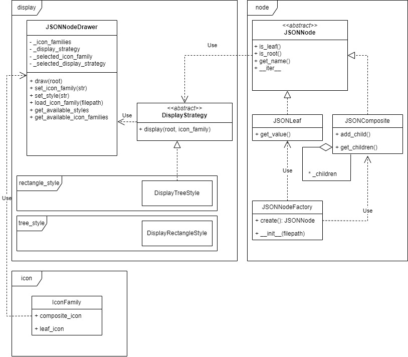

# 设计文档

## 类图说明与项目结构

模块说明：

1. exception: 定义了一个异常类，用于捕获所有预期的异常
2. main: 读取命令行参数，调用建造者获得 StyledJSON，并调用渲染
3. node: 定义了项目使用的可视化数据结构，同时包含一个读取 json 文件创建该数据结构的简单工厂
4. icon: 存储处理 icon 相关的数据
5. style: 存储风格渲染相关的类
   1. style: 定义了抽象工厂接口和抽象产品接口
   2. __init__: 定义了一个建造者 StyleJSONBuilder ，负责获取对应的工厂和 icon_family 并完成组装
   3. tree_style: 定义了一个树形风格的实现
   4. rectangle_style: 定义了一个矩形风格的实现

类图：

## 使用的设计模式

1. 工厂方法：StyledJSONNodeFactory 的 create 是工厂方法，它负责创建具体的风格对象。
2. 抽象工厂：StyledJSONNodeFactory 是抽象工厂接口，TreeStyleFactory、RectangleStyleFactory 是具体的抽象工厂，每个抽象工厂根据不同的 icon_family 创造出不同的 StyledJSONNode 产品。
3. 建造者：StyleJSONBuilder 是建造者接口，负责组装 StyledJSONNode 产品。
4. 组合模式：JSONNode、JSONLeaf、JSONComposite 是组合模式的实现，分别对应 component、leaf、composite。
5. 简单工厂：JSONNodeFactory 是简单工厂，他根据文件名读取 json 并创建 JSONNode 产品。
6. 迭代器模式：JSONComposite 实现了迭代器接口